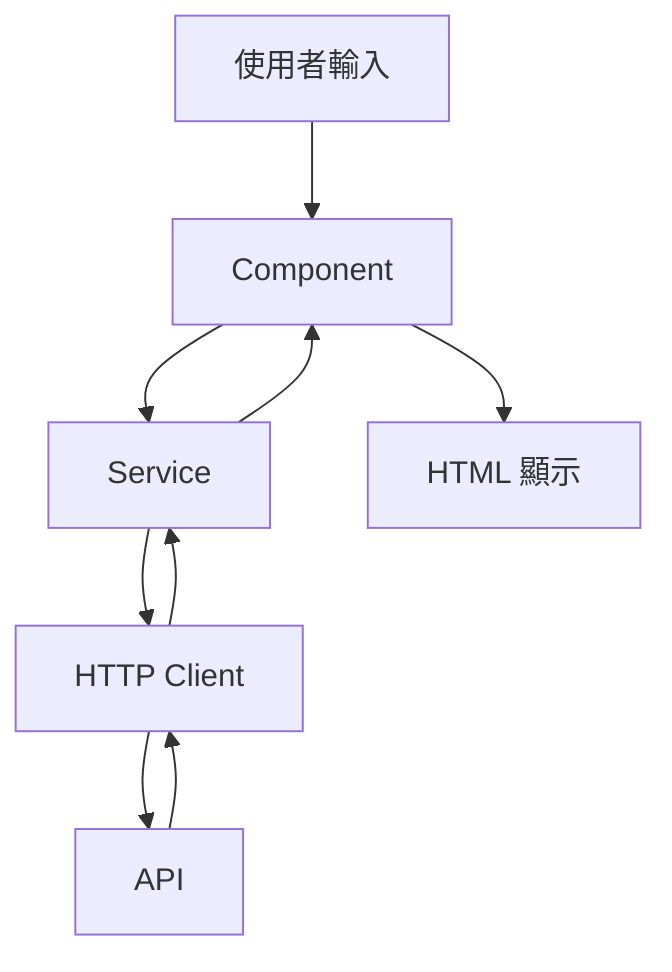

# Angular 專案架構與 API 整合說明

## 1. 專案基本架構

### 1.1 核心檔案說明
```
angular-search-and-display/
├── src/
│   ├── app/                       # 應用程式主要程式碼
│   │   ├── services/              # 服務層，處理資料和業務邏輯
│   │   │   └── search.service.ts  # 搜尋相關的服務
│   │   ├── app.component.ts       # 主要元件的 TypeScript 檔案
│   │   ├── app.component.html     # 主要元件的 HTML 模板
│   │   └── app.module.ts          # 應用程式的主要模組
│   └── main.ts                    # 應用程式的入口點
```
```
angular-search-and-display/
├── src/                      # Main source directory
│   ├── app/                  # Application components
│   │   ├── app.component.ts  # Root component
│   │   ├── app.module.ts     # Root module
│   ├── assets/               # Static assets
│   └── index.html            # Main HTML entry point
├── node_modules/             # Installed dependencies
└── package.json              # Project configuration file
```

### 1.2 檔案角色說明
- **app.component.ts**: 主要元件，處理使用者介面邏輯
- **app.component.html**: 定義使用者介面結構
- **search.service.ts**: 處理搜尋相關的業務邏輯和 API 呼叫
- **main.ts**: 啟動應用程式的入口點

## 2. Angular 與 API 整合

### 2.1 基本概念
Angular 使用 TypeScript（JavaScript 的超集）來撰寫程式碼，主要有以下幾個重要概念：

1. **Component（元件）**
   - 負責顯示畫面和處理使用者互動
   - 包含 `.ts`、`.html` 和 `.css` 檔案

2. **Service（服務）**
   - 處理業務邏輯和 API 呼叫
   - 可被注入到多個元件中重複使用

3. **Observable（可觀察物件）**
   - 處理非同步操作
   - 用於 API 呼叫和資料流處理

### 2.2 API 整合流程說明

1. **在 Service 中定義 API 呼叫**
```typescript
// search.service.ts
@Injectable()
export class SearchService {
  constructor(private http: HttpClient) {}

  searchBooks(query: string): Observable<SearchResult> {
    return this.http.get<SearchResult>(
      `https://openlibrary.org/search.json?q=${query}`
    );
  }
}
```

2. **在 Component 中使用 Service**
```typescript
// app.component.ts
export class AppComponent {
  constructor(private searchService: SearchService) {}

  search(query: string) {
    this.searchService.searchBooks(query)
      .subscribe(results => {
        this.searchResults = results;
      });
  }
}
```

3. **在 HTML 中顯示結果**
```html
<!-- app.component.html -->
<div *ngFor="let book of searchResults">
  <h2>{{ book.title }}</h2>
  <p>{{ book.author }}</p>
</div>
```

### 2.3 資料流向說明



## 3. Angular 特殊語法說明

### 3.1 模板語法
- `{{ }}`: 插值表達式，顯示變數值
- `*ngFor`: 迴圈指令
- `*ngIf`: 條件渲染
- `(click)`: 事件綁定
- `[value]`: 屬性綁定

例如：
```html
<!-- 顯示資料 -->
<div>{{ bookTitle }}</div>

<!-- 迴圈 -->
<div *ngFor="let book of books">
  {{ book.title }}
</div>

<!-- 條件渲染 -->
<div *ngIf="isLoading">載入中...</div>

<!-- 事件處理 -->
<button (click)="search()">搜尋</button>

<!-- 屬性綁定 -->
<input [value]="searchText">
```

### 3.2 Dependency Injection（依賴注入）
Angular 使用依賴注入來管理元件和服務之間的關係：

```typescript
@Injectable()
export class SearchService {
  // 服務的實作
}

@Component({
  // ...
  providers: [SearchService]  // 宣告服務
})
export class AppComponent {
  constructor(private searchService: SearchService) {
    // 自動注入服務
  }
}
```

## 4. 本專案中的 Open Library API 整合

### 4.1 API 端點
```
https://openlibrary.org/search.json?q=${searchQuery}&page=${page}&limit=${pageSize}
```

### 4.2 參數說明
- `q`: 搜尋關鍵字
- `page`: 頁碼
- `limit`: 每頁顯示數量

### 4.3 回應格式
```typescript
interface SearchResult {
  num_found: number;
  docs: {
    title: string;
    author_name: string[];
    cover_edition_key: string;
  }[];
}
```

### 4.4 使用範例
```typescript
// 使用 RxJS 處理 API 呼叫
searchResults$ = this.$search.currentSearch$.pipe(
  filter((search): search is CurrentSearch => search !== null),
  switchMap(search => this.searchBooks(search)),
  catchError(error => {
    console.error('Search error:', error);
    return new BehaviorSubject<SearchResult>({
      num_found: 0,
      docs: []
    });
  })
);
```

## 5. 常見問題與解決方案

### 5.1 API 錯誤處理
```typescript
searchBooks().pipe(
  catchError(error => {
    console.error('API Error:', error);
    return of([]); // 返回空陣列作為預設值
  })
)
```

### 5.2 載入狀態管理
```typescript
loading = false;

search() {
  this.loading = true;
  this.searchService.searchBooks()
    .pipe(finalize(() => this.loading = false))
    .subscribe(results => {
      this.results = results;
    });
}
```

### 5.3 分頁處理
```typescript
// 在 Component 中
onPageChange(pageIndex: number) {
  this.currentPage = pageIndex;
  this.searchService.search(this.searchText, this.currentPage);
}
```

## 6. 開發建議

1. **型別安全**
   - 始終定義介面描述 API 回應
   - 使用 TypeScript 的型別檢查功能

2. **錯誤處理**
   - 實作適當的錯誤處理機制
   - 提供使用者友善的錯誤訊息

3. **狀態管理**
   - 使用 RxJS 處理複雜的資料流
   - 適當管理載入和錯誤狀態

4. **程式碼組織**
   - 將業務邏輯放在 Service 中
   - 保持 Component 簡潔，主要處理視圖邏輯